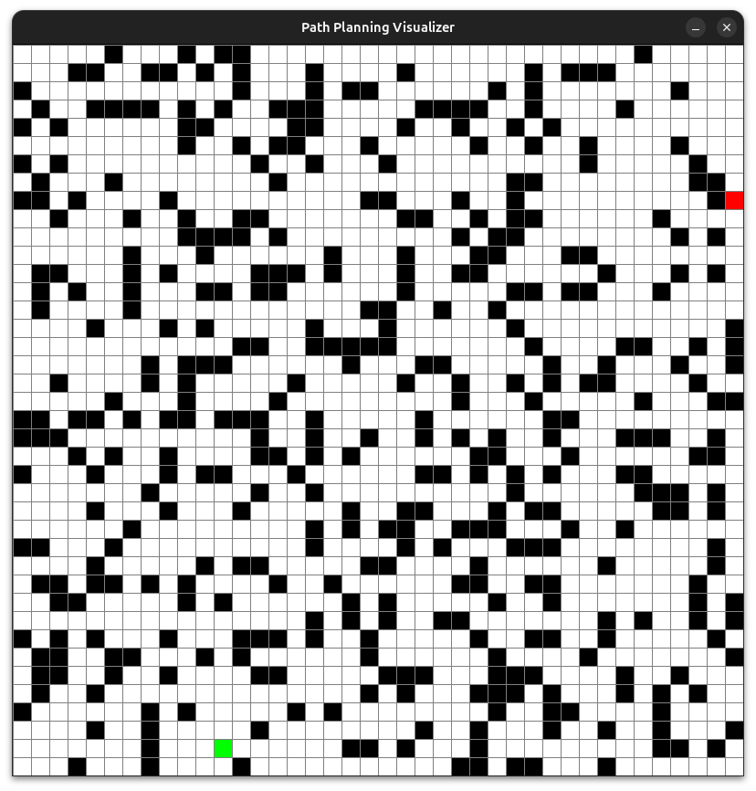

# Path-Planning-Sim
A Python and Pygame based visualization tool for learning and experimenting with path planning algorithms.

## Features
- Grid-based environment
- Random obstacle generation
- Random start and goal generation
- BFS visualization (coming soon)
- A* visualization (planned)
- Dijkstra visualization (planned)
- Interactive GUI (planned)

## Installation
Clone the repository:
```bash
git clone <repository_url>
cd /path-planning-sim
```

Create a virtual environment:
```bash
python3 -m venv venv
```

Activate the virtual environment:
### Linux
```bash
source venv/bin/activate
```

Install dependencies:
```bash
pip install -r requirements.txt
```

## Running
Linux:
```bash
python3 main.py
```

## Controls
| Key | Action |
|------|----------|
| R | Generate a new random map |
| SPACE | Run BFS |
| A | Run A* |
| D | Run Dijkstra |

## Project Roadmap
- [x] Grid generation
- [x] Random obstacle generation
- [x] Random start and goal generation
- [ ] BFS visualization
- [ ] DFS visualization
- [ ] Dijkstra visualization
- [ ] A* visualization
- [ ] Diagonal movement
- [ ] Path smoothing
- [ ] Full GUI

## Screenshot


## License
GNU General Public License V3.0